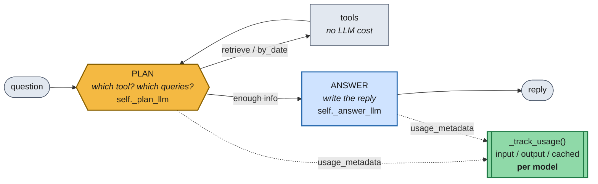
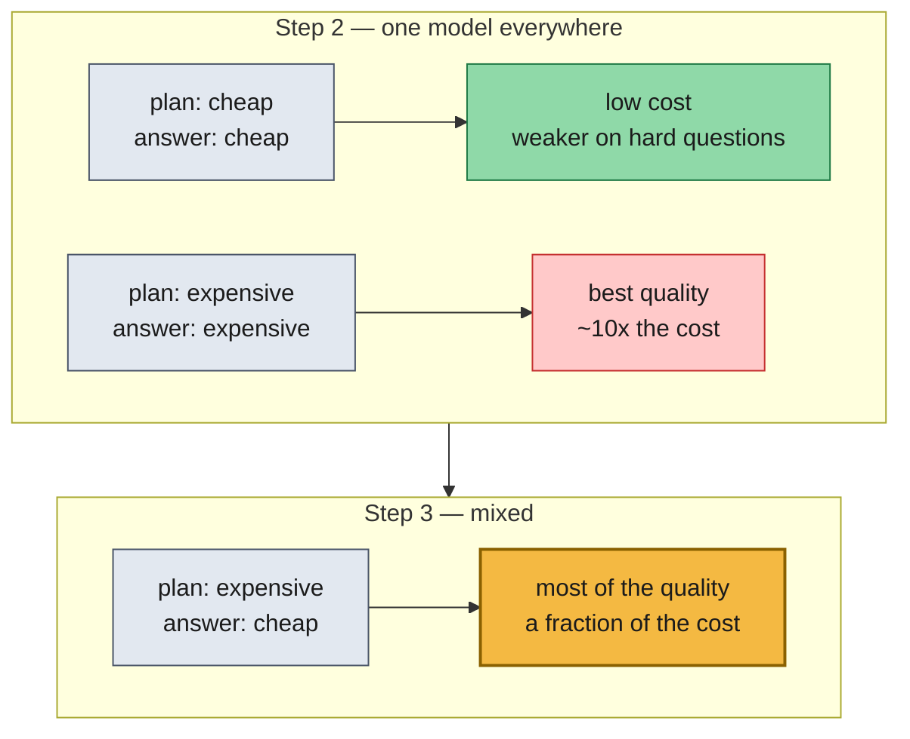

# Lab 6.2 — Measuring What the Agent Costs, and Cutting It

Lab 6.1 asked whether the agent could be broken. This one asks what it costs to
run. Same tool-using agent from Lab 5.2, now **instrumented**: every LLM call
reports its token usage, so you can compare models on quality *and* price — and
then discover you don't have to pick just one.

There are only two ways to spend less: **use fewer tokens**, or **use cheaper
tokens**. Neither is possible until you can measure.



**The key realisation:** the agent makes *two different kinds* of LLM call, and
Lab 5.2 pointed both at the same model for no reason other than convenience.
Splitting them into `plan_model` and `answer_model` is what makes the whole
experiment possible.



Why mixed works: **most of this agent's intelligence lives in the PLAN step** —
choosing the tool, phrasing the queries, deciding when to stop. The answer step
is largely templating already-retrieved e-mails. So pay for a strong planner and
let a cheap model do the writing.

---

## Folder layout

```text
lab-6.2/
├── lab_6_2_cost_measurement_solution.py       ← completed reference
└── Live_Guided_Virtual_Lab_6_2_starter/
    ├── lab_6_2_cost_measurement_starter.py    ← 2 TODOs (Step 1a, Step 1b)
    ├── requirements.txt
    └── detailedEmails/                        ← 7,894 .txt emails
```

> The solution file sits at the lab root rather than in a `..._solution/` folder,
> and has no `detailedEmails/` beside it — pass the starter's copy as the first
> argument when running it.

## Setup

```bash
source .venv/bin/activate
pip install -r requirements.txt
echo "OPENROUTER_API_KEY=sk-or-your-key-here" > .env
```

```bash
# Step 2 only — free + cheap models on the 4-question suite
python lab_6_2_cost_measurement_solution.py detailedEmails

# adds gpt-5.2-pro and the mixed run (~10x cost)
python lab_6_2_cost_measurement_solution.py detailedEmails --expensive
```

### What a run produces

```text
### Step 2 — one model at a time (cheap models by default) ###

==============================================================================
EXPERIMENT: openai/gpt-4o-mini
==============================================================================

Q1. What e-mails were sent on 01/01/2014?
    -> On 01/01/2014 there were six e-mails, covering ...
...
Token usage:
openai/gpt-4o-mini: 48213 input, 1102 output, 0 cached
Approx. cost (USD, see disclaimer): $0.0079
```

With `--expensive` you additionally get the `gpt-5.2-pro` row and the **MIXED**
run, which is the one to compare against. Nothing is written to disk except
`chroma_db/`.

---

## Core concepts in this lab

- **You can't optimise what you don't measure.** The lab's real subject is the
  instrumentation, not the savings. `usage_metadata` was always on every
  response — nobody was reading it.
- **Tokens are the unit of cost**, split into *input* (the prompt you send) and
  *output* (what comes back), priced differently — output is typically 3–4× input.
- **Per-role model routing.** One system, several LLM calls, each with different
  difficulty. Uniform model choice is a default, not a decision.
- **Cached input tokens.** Providers discount prompt prefixes they've seen
  before, reported as `cache_read`. Stable prompt prefixes are therefore a cost
  strategy, not just tidiness.
- **Cost ladders.** `free → cheap → expensive` spans ~100× in price. The question
  is never "which model is best" but "which model is good enough *for this step*".
- **Quality/cost is a curve, not a switch.** The mixed configuration only exists
  because you measured both ends first.

### Where the tokens actually go

| Source | Token weight | Notes |
| --- | --- | --- |
| PLAN prompt | **large** | Carries up to 20 retrieved e-mails, conversation, executed queries — *and runs once per loop iteration* |
| ANSWER prompt | large | Every accumulated e-mail |
| Retrieval itself | **zero** | BM25 + Chroma are local; only embeddings cost, and those are already paid |
| Outputs | small | A JSON plan, then one reply |

The uncomfortable detail: the planner is invoked on **every** iteration, so an
agent that loops three times pays the big prompt three times. Multi-step
reasoning is not free, and Lab 5.1's `MAX_ITERATIONS` is a cost control as much
as a safety one.

### Quick comparison to Lab 5.2

| | Lab 5.2 | Lab 6.2 |
| --- | --- | --- |
| Agent logic | plan / retrieve / by_date / clarify / answer | **identical** |
| Models | one for everything | `plan_model` + `answer_model` |
| LLM clients | `self._llm` | `self._plan_llm`, `self._answer_llm` |
| Token visibility | none | `_track_usage()` on every call |
| Question asked | does it work? | what does it cost, and can we cut it? |

---

## What is already provided (walk through, don't rewrite)

| Piece | Why it matters |
| --- | --- |
| The whole Lab 5.2 agent | Graph, nodes, routing, tools — unchanged. |
| `CHEAP_MODELS` / `EXPENSIVE_MODEL` / `MIXED_*` | The cost ladder and the Step 3 configuration, as data. |
| `EXPERIMENT_QUESTIONS` | Deliberately **4 questions**. Every run is real money. |
| `APPROX_PRICE_PER_MTOK` | Hardcoded USD-per-million-token rates for a rough estimate. |
| `estimate_cost_usd()` | `input × in_rate + output × out_rate`, summed per model. |
| `run_experiment()` | Builds an agent with the given per-role models, runs the suite, prints usage + cost. |
| `_safe_experiment()` | Swallows provider errors so one rate-limited free model doesn't kill the run. |
| `get_token_usage()` / `print_token_usage()` / `reset_token_usage()` | Read, show, clear the tally. |

### Notes on a couple of non-obvious bits

- **`reset_token_usage()` is called before each experiment** — otherwise the
  tally would accumulate across models and every comparison would be wrong.
- **`estimate_cost_usd` counts cached tokens at the full input rate**, so it's an
  upper-ish bound. Real bills are lower. It also silently contributes `0` for any
  model missing from the price table — a quiet way to get a misleading total.
- **Prices are hardcoded and will drift.** The file says to check
  `openrouter.ai/models` before quoting real numbers, and `gpt-5.2-pro`'s rate is
  an illustrative placeholder.
- **`retriever_model` exists for API parity only** — retrieval makes no chat-LLM
  calls, so it never affects the tally.
- **Free models are heavily rate-limited upstream.** `gemma-4-31b-it:free` fails
  with HTTP 429 often enough that `_safe_experiment` exists specifically for it.
- **The free model's price is `0.0`**, so its cost line always reads `$0.0000` —
  that's the price table, not a measurement bug.

---

## The two TODOs for learners

### Step 1a — split the one LLM client into two

```python
self._plan_model = plan_model or llm_model
self._answer_model = answer_model or llm_model
self._plan_llm = ChatOpenAI(model=self._plan_model, api_key=..., base_url=...)
self._answer_llm = ChatOpenAI(model=self._answer_model, api_key=..., base_url=...)
```

Then use `self._plan_llm` in `plan_node` and `self._answer_llm` in `answer_node`.

Teaching points:
- Defaulting to `llm_model` keeps the old single-model behaviour when nobody
  passes the new arguments — a backwards-compatible refactor.
- Storing the **model names** alongside the clients is what lets `_track_usage`
  bucket tokens by model.
- This is a three-line change that unlocks the entire Step 3 result. Worth
  pausing on: the expensive insight was noticing the two calls were different.

### Step 1b — `_track_usage(response, model_name)`

```python
usage = getattr(response, "usage_metadata", None)
if not usage:
    return                      # some models/providers omit it — don't crash
bucket = self._token_usage.setdefault(model_name, {"input": 0, "output": 0, "cached": 0})
bucket["input"] += usage.get("input_tokens", 0)
bucket["output"] += usage.get("output_tokens", 0)
details = usage.get("input_token_details", {})
bucket["cached"] += details.get("cache_read", 0)
```

Call it immediately after each `.invoke()`.

Teaching points:
- **The data was always there.** Every LangChain response carries
  `usage_metadata`; the lab just starts reading it.
- `getattr(..., None)` and the early return matter — not every provider populates
  it, and a missing field shouldn't take down a run.
- `setdefault` creates the per-model bucket on first sight, so no model list
  needs to be declared up front.
- `cache_read` lives one level down in `input_token_details`, and it's the only
  number here that reflects a *discount* rather than a charge.
- Keying by model name is what makes the mixed run legible — you see the
  planner's tokens and the answer model's tokens as separate lines.

---

## Demo flow

1. Run the default (cheap) pass. Note that the free and cheap models handle the
   date lookup and the straightforward retrieval questions perfectly well.
2. Run with `--expensive`. Compare `gpt-5.2-pro`'s answers *and* its token cost
   against `gpt-4o-mini`'s — better on the hard multi-hop question, ~10× the bill.
3. Look at the **MIXED** run last. Strong planner, cheap writer: most of the
   quality, a fraction of the cost.
4. Point at the per-model token lines and ask which step you'd actually pay to
   upgrade.

Closing point: this is the last lab, and it reframes everything before it. Each
module added capability — hybrid fusion, graph expansion, decomposition, agentic
loops — and every one of them spends tokens. Knowing *where* they go is what
makes the difference between a demo and something you can afford to run.
